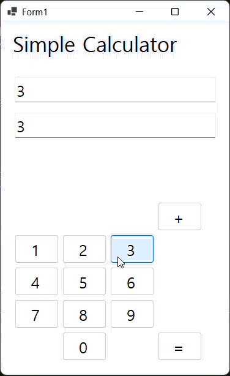
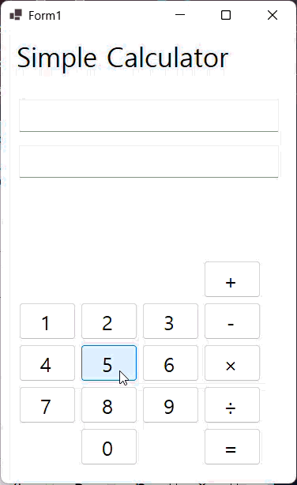
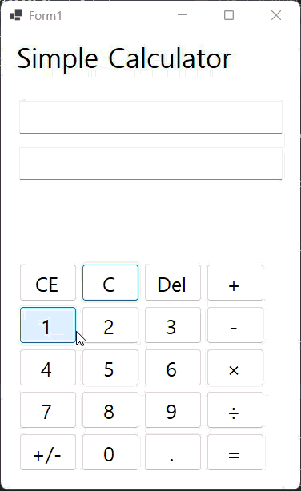

# (C# 코딩) 에코메신저

## 개요
-C# 프로그래밍학습
-핵심기능: ...
-화면구성: ...
-사용한 플랫폼: 
  -C#, .NET Windows Forms, Visual Studio, GitHub
-사용한 컨트롤:
  -Label, TextBox, Button
-사용한 기술과 구현한 기능:
  -UI 구성 : TextBox(입력표시, 결과표시), Button(계산) 등을 배치
  -숫자 입력 기능 : 숫자 Button 클릭 시 TextBox에 표시. 계산 식과 입력 값 2가지 표시
  -사칙 연산 계산기능 : 2개의 피연산자의 입력 값을 Int로 바꾸어 더하기 계산을 수행하고 그 결과를 저장
  -사칙 연산 버튼 이벤트 연결: 뺄셈, 곱셈, 나눗셈, 버튼 추가
  -계산 결과 출력 : 계산 결과값을 문자열로 변환하여 표시
  -특수 버튼 추가 : C(현재 모든 내용 삭제), CE(마지막 입력한 피연산자 값 삭제), Del(마지막 입력된 글자 하나(숫자 하나) 값 삭제

## 실행 화면(과제1)
-1단계 코드의 실행 스크린샷

-과제 내용
  UI 구성
  숫자 입력 기능
  사칙연산 계산 기능
  계산 결과 출력
-구현 내용과 기능 설명
  기본 UI 배치 완료
  숫자 입력 받아서 textResultBox와 textInputBox에 넣기
  + 연산자 클릭 시 textResultBox에 추가
  연산자가 이미 들어와있을 시 추가 입력 받지 않음
  textResultBox에 모든 식을 넣어서 출력하고
  textInputBox에는 지금 입력하는 숫자만 출력
  결과를 출력할때는 resultText에 있는 값을 계산한 뒤 = 결과값을 출력
  결과 값을 출력하고도 결과 값에 이어서 입력 가능

## 실행 화면(과제2)
-2단계 코드의 실행 스크린샷

(여기에이미지삽입)
-과제 내용
  빼기, 곱하기, 나누기 구현 및 버튼 추가
-구현 내용과 기능 설명
  빼기, 곱하기, 나누기 버튼 추가 완료
  실수 연산도 가능하도록 추가
  
## 실행 화면(과제3)
-3단계 코드의 실행 스크린샷

-과제 내용
  C, CE, Del 구현 및 버튼 추가
-구현 내용과 기능 설명
  C버튼 : 현재의 모든 내용을 삭제
  CE버튼 : 마지막 입력한 피연산자 값 삭제
  Del버튼 : 마지막 입력된 숫자 혹은 연산자 삭제

## 실행 화면(과제4)
-4단계 코드의 실행 스크린샷

-과제 내용
  자율적 기능 추가
-구현 내용과 기능 설명
  . (소수점 버튼) 구현 완료
  resultTempText를 추가하여
  실제 계산은 resultText를 하지만
  우리가 보는 출력은 resultTempText로 곱셈 기호와 나눗셈 기호를 나타낼 수 있도록 수정
  +/- 버튼을 추가하여
  숫자에 부호를 추가 할 수 있도록 수정
  +일때 누른다면 -
  - 일때 누른다면 +로 전환
  연산자 추가할때 textInputBox에 연산자 출력 안되는 문제 수정
  